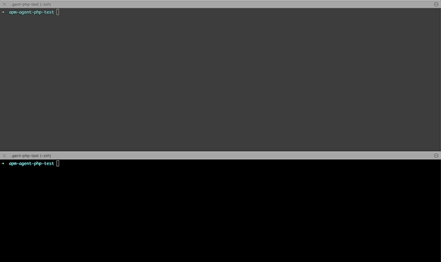

# Elastic APM PHP agent opcache stress test

## Setup

* Ubuntu 18.08
* APM agent 1.5.1 prebuild from github
* PHP 7.4 prebuilt from ppa:ondrej/php
* Symfony 4.4

## Test

* Run `./start.sh`
* At the same time in other console run `./test.sh`
* After approx 10 seconds FPM workers dies with signal SIGSEGV

